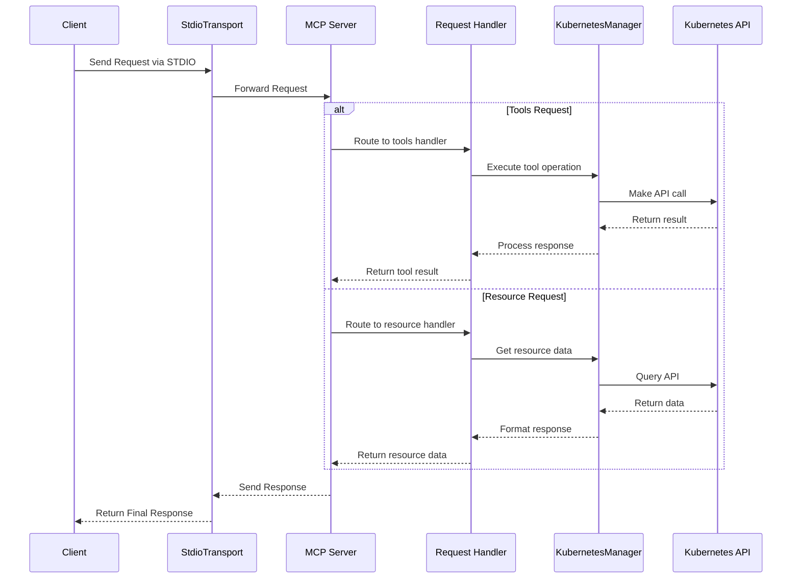

```mermaid
sequenceDiagram
    participant Client
    participant Transport as StdioTransport
    participant Server as MCP Server
    participant Handler as Request Handler
    participant K8sManager as KubernetesManager
    participant K8s as Kubernetes API

    Client->>Transport: Send Request via STDIO
    Transport->>Server: Forward Request

    alt Tools Request
        Server->>Handler: Route to tools handler
        Handler->>K8sManager: Execute tool operation
        K8sManager->>K8s: Make API call
        K8s-->>K8sManager: Return result
        K8sManager-->>Handler: Process response
        Handler-->>Server: Return tool result
    else Resource Request
        Server->>Handler: Route to resource handler
        Handler->>K8sManager: Get resource data
        K8sManager->>K8s: Query API
        K8s-->>K8sManager: Return data
        K8sManager-->>Handler: Format response
        Handler-->>Server: Return resource data
    end

    Server-->>Transport: Send Response
    Transport-->>Client: Return Final Response
```
